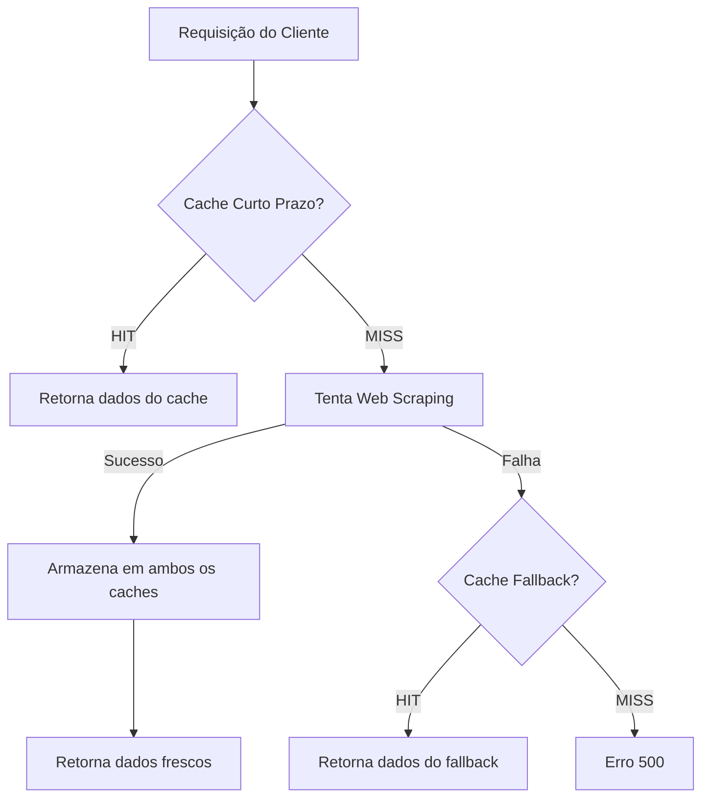

# API Flask de Web Scraping - Dados Vitivinícolas

Esta é uma API Flask que realiza web scraping do site da Embrapa para extrair dados vitivinícolas brasileiros.

## Funcionalidades

- **Autenticação HTTP Basic**: Acesso seguro aos endpoints
- **5 Endpoints de dados**: Produção, Processamento, Comercialização, Importação e Exportação
- **Filtros por ano e sub-opções**: Parâmetros opcionais para refinar consultas
- **Parsing inteligente de tabelas**: Extração estruturada de dados HTML
- **Documentação Swagger**: Interface interativa para testar a API
- **Tratamento de erros**: Logging detalhado e respostas estruturadas
- **Dados de fallback**: Arquivos CSV locais como fonte alternativa de dados

## Configuração do Ambiente

### Opção 1: Docker (Recomendado)

#### Deploy Rápido com Versionamento Automático
```bash
# Deploy completo com rebuild e versionamento
python docker-deploy.py

# Deploy para produção
python docker-deploy.py --env production

# Deploy sem rebuild (usar imagem existente)
python docker-deploy.py --no-rebuild

# Deploy com logs
python docker-deploy.py --logs
```

#### Comandos Docker Manuais
```bash
# Construir imagem com versionamento
python docker-build.py

# Construir para produção
python docker-build.py --env production

# Iniciar com docker-compose
docker-compose up -d

# Ver logs
docker-compose logs -f app

# Parar containers
docker-compose down

# Rebuild completo
docker-compose down && docker-compose build --no-cache && docker-compose up -d
```

#### Verificar Versão no Docker
```bash
# Testar API e ver versão atual
curl http://localhost:5000/heartbeat

# Ver informações da imagem Docker
docker images flask-webscraping-api

# Ver labels da imagem (metadados de versão)
docker inspect flask-webscraping-api:latest
```

### Opção 2: Ambiente Local

#### 1. Criar e Ativar Ambiente Virtual

**Windows:**
```bash
# Criar ambiente virtual
python -m venv venv

# Ativar ambiente virtual
venv\Scripts\activate
```

**Linux/Mac:**
```bash
# Criar ambiente virtual
python -m venv venv

# Ativar ambiente virtual
source venv/bin/activate
```

#### 2. Instalar Dependências

```bash
pip install -r requirements.txt
```

#### 3. Executar a Aplicação

```bash
python app.py
```

A aplicação estará disponível em: `http://localhost:5000`

## Endpoints Disponíveis

### Autenticação
- **Usuário 1**: `user1` / `password1`
- **Usuário 2**: `user2` / `password2`

### Endpoints de Dados

| Endpoint | Descrição | Parâmetros Opcionais | Autenticação |
|----------|-----------|---------------------|---------------|
| `/producao` | Dados de produção | `year`, `sub_option` | ✅ Requerida |
| `/processamento` | Dados de processamento | `year`, `sub_option` | ✅ Requerida |
| `/comercializacao` | Dados de comercialização | `year`, `sub_option` | ✅ Requerida |
| `/importacao` | Dados de importação | `year`, `sub_option` | ✅ Requerida |
| `/exportacao` | Dados de exportação | `year`, `sub_option` | ✅ Requerida |

### Endpoints de Monitoramento

| Endpoint | Descrição | Autenticação |
|----------|-----------|--------------|
| `/heartbeat` | Health check da API | ❌ Não requerida |

### Documentação Swagger
Acesse: `http://localhost:5000/apidocs/`

### Collection Postman
- **Arquivo**: `postman_collection.json`
- **Guia de uso**: `POSTMAN_GUIDE.md`
- **Importar no Postman**: Import > Upload Files > Selecionar `postman_collection.json`

## Parâmetros de Filtro

### Parâmetro `year`
- **Tipo**: Integer
- **Range válido**: 1970-2024
- **Descrição**: Ano para filtrar os dados (válido para todas as APIs)
- **Exemplo**: `?year=2023`

### Parâmetro `sub_option`
- **Tipo**: String
- **Descrição**: Sub-opção específica para cada endpoint
- **Validação**: Lista fechada de valores por endpoint

#### Valores válidos por endpoint:

**`/producao`**
- `VINHO DE MESA`
- `VINHO FINO DE MESA (VINIFERA)`
- `SUCO DE UVA`
- `DERIVADOS`

**`/processamento`**
- `viniferas`
- `americanas`
- `mesa`
- `semclass`

**`/comercializacao`**
- `VINHO DE MESA`
- `ESPUMANTES`
- `UVAS FRESCAS`
- `SUCO DE UVA`

**`/importacao`**
- `vinhos`
- `espumantes`
- `frescas`
- `passas`
- `suco`

**`/exportacao`**
- `vinho`
- `uva`
- `espumantes`
- `suco`

### Validação de Parâmetros
- Parâmetros inválidos retornam erro **HTTP 400** com mensagem explicativa
- Ambos os parâmetros são **opcionais**
- Podem ser usados individualmente ou em combinação

## Exemplos de Uso

### 1. Usando curl

```bash
# Dados de produção (sem filtros)
curl -u user1:password1 "http://localhost:5000/producao"

# Dados de produção filtrados por ano
curl -u user1:password1 "http://localhost:5000/producao?year=2023"

# Dados de produção com sub-opção específica
curl -u user1:password1 "http://localhost:5000/producao?sub_option=VINHO%20DE%20MESA"

# Dados de produção com ambos os filtros
curl -u user1:password1 "http://localhost:5000/producao?year=2023&sub_option=SUCO%20DE%20UVA"

# Dados de processamento com filtros
curl -u user1:password1 "http://localhost:5000/processamento?year=2022&sub_option=viniferas"

# Dados de exportação com filtros
curl -u user1:password1 "http://localhost:5000/exportacao?year=2023&sub_option=vinho"

# Exemplo de erro - ano inválido (retorna HTTP 400)
curl -u user1:password1 "http://localhost:5000/producao?year=1969"

# Exemplo de erro - sub-opção inválida (retorna HTTP 400)
curl -u user1:password1 "http://localhost:5000/producao?sub_option=OPCAO_INEXISTENTE"

# Health check da API (sem autenticação)
curl "http://localhost:5000/heartbeat"
```

### 2. Usando Python requests

```python
import requests
from requests.auth import HTTPBasicAuth

# Configurar autenticação
auth = HTTPBasicAuth('user1', 'password1')

# Exemplo 1: Requisição básica sem filtros
response = requests.get(
    'http://localhost:5000/producao',
    auth=auth
)

if response.status_code == 200:
    data = response.json()
    print("Dados de produção:", data)
else:
    print(f"Erro: {response.status_code}")

# Exemplo 2: Requisição com filtros válidos
response = requests.get(
    'http://localhost:5000/producao',
    auth=auth,
    params={
        'year': '2023',
        'sub_option': 'VINHO DE MESA'
    }
)

if response.status_code == 200:
    data = response.json()
    print("Dados filtrados:", data)
else:
    print(f"Erro: {response.status_code}")

# Exemplo 3: Tratamento de erro de validação
response = requests.get(
    'http://localhost:5000/producao',
    auth=auth,
    params={'year': '1969'}  # Ano inválido
)

if response.status_code == 400:
    error_data = response.json()
    print(f"Erro de validação: {error_data['error']}")
elif response.status_code == 200:
    data = response.json()
    print("Dados:", data)

# Exemplo 4: Diferentes endpoints com suas sub-opções
endpoints_examples = {
    'processamento': {'year': '2023', 'sub_option': 'viniferas'},
    'comercializacao': {'year': '2022', 'sub_option': 'ESPUMANTES'},
    'importacao': {'year': '2023', 'sub_option': 'vinhos'},
    'exportacao': {'year': '2023', 'sub_option': 'uva'}
}

for endpoint, params in endpoints_examples.items():
    response = requests.get(
        f'http://localhost:5000/{endpoint}',
        auth=auth,
        params=params
    )
    
    if response.status_code == 200:
        data = response.json()
        cache_status = data.get('cached', 'unknown')
        print(f"✅ {endpoint}: Dados obtidos com sucesso (cache: {cache_status})")
    else:
        print(f"❌ {endpoint}: Erro {response.status_code}")

# Exemplo 5: Monitoramento de cache e performance
import time

def test_cache_performance():
    """Demonstra o funcionamento do cache"""
    
    # Primeira requisição (dados frescos)
    start_time = time.time()
    response1 = requests.get('http://localhost:5000/producao?year=2023', auth=auth)
    time1 = time.time() - start_time
    
    if response1.status_code == 200:
        data1 = response1.json()
        print(f"1ª requisição: {time1:.2f}s - Cache: {data1.get('cached', 'unknown')}")
    
    # Segunda requisição (cache hit)
    start_time = time.time()
    response2 = requests.get('http://localhost:5000/producao?year=2023', auth=auth)
    time2 = time.time() - start_time
    
    if response2.status_code == 200:
        data2 = response2.json()
        print(f"2ª requisição: {time2:.2f}s - Cache: {data2.get('cached', 'unknown')}")
        print(f"Melhoria de performance: {((time1 - time2) / time1 * 100):.1f}%")

# Executar teste de performance
test_cache_performance()
```

## Estrutura de Resposta

### Resposta Padrão com Cache
```json
{
  "data": {
    "header": [
      ["Coluna1", "Coluna2", "Coluna3"]
    ],
    "body": [
      {
        "item_data": ["Item Principal"],
        "sub_items": [
          ["Sub-item 1", "Valor 1"],
          ["Sub-item 2", "Valor 2"]
        ]
      }
    ],
    "footer": [
      ["Total", "Valor Total"]
    ]
  },
  "cached": false
}
```

### Indicadores de Cache
- `"cached": false` - Dados frescos obtidos via web scraping
- `"cached": "short_term"` - Dados do cache de curto prazo (5 min)
- `"cached": "fallback"` - Dados do cache de fallback (24h)

## Dependências Principais

- **Flask**: Framework web
- **requests**: Cliente HTTP para web scraping
- **BeautifulSoup4**: Parser HTML/XML
- **Flask-HTTPAuth**: Autenticação HTTP Basic
- **flasgger**: Documentação Swagger automática
- **Redis**: Sistema de cache em memória

## Sistema de Cache Inteligente

A aplicação implementa um **sistema de cache de duas camadas** usando Redis para otimizar performance e garantir disponibilidade dos dados mesmo quando o site da Embrapa está indisponível.

### Arquitetura do Cache

#### 🚀 Cache de Curto Prazo (Short-term Cache)
- **Finalidade**: Acelerar requisições frequentes
- **TTL padrão**: 5 minutos (300 segundos)
- **Prefixo**: `short:`
- **Uso**: Dados recentes para evitar web scraping desnecessário

#### 🛡️ Cache de Fallback (Fallback Cache)
- **Finalidade**: Garantir disponibilidade quando o site fonte está indisponível
- **TTL padrão**: 24 horas (86400 segundos)
- **Prefixo**: `fallback:`
- **Uso**: Dados de backup para situações de emergência

### Fluxo de Funcionamento



#### Estratégia de Cache por Requisição

1. **Primeira tentativa**: Busca no cache de curto prazo
   - Se encontrado: retorna imediatamente com `"cached": "short_term"`
   
2. **Segunda tentativa**: Web scraping do site da Embrapa
   - Se bem-sucedido: armazena em ambos os caches e retorna com `"cached": false`
   
3. **Terceira tentativa**: Busca no cache de fallback
   - Se encontrado: retorna dados antigos com `"cached": "fallback"`
   - Se não encontrado: retorna erro 500

### Configuração do Cache

#### Variáveis de Ambiente
```bash
# Cache de curto prazo (em segundos)
SHORT_CACHE_TTL=300          # 5 minutos (padrão)

# Cache de fallback (em segundos)  
FALLBACK_CACHE_TTL=86400     # 24 horas (padrão)

# Configuração Redis (opcional)
REDIS_HOST=localhost         # Host do Redis
REDIS_PORT=6379             # Porta do Redis
REDIS_DB=0                  # Database do Redis
```

#### Configuração Docker
O Redis é automaticamente configurado via `docker-compose.yml`:
```yaml
services:
  redis:
    image: redis:7-alpine
    ports:
      - "6379:6379"
    
  app:
    environment:
      - SHORT_CACHE_TTL=300
      - FALLBACK_CACHE_TTL=86400
```

### Chaves de Cache

#### Formato das Chaves
```
{prefixo}{endpoint}:{hash_md5}
```

**Exemplos:**
- `short:producao:a1b2c3d4e5f6...` - Cache curto para produção
- `fallback:exportacao:f6e5d4c3b2a1...` - Cache fallback para exportação

#### Geração de Hash
O hash MD5 é gerado baseado em:
- Nome do endpoint
- Parâmetros da requisição (year, sub_option)
- Ordenação consistente para garantir chaves únicas

### Indicadores de Cache na Resposta

Todas as respostas incluem o campo `cached` indicando a origem dos dados:

```json
{
  "data": { ... },
  "cached": false              // Dados frescos do web scraping
}
```

```json
{
  "data": { ... },
  "cached": "short_term"       // Dados do cache de curto prazo
}
```

```json
{
  "data": { ... },
  "cached": "fallback"         // Dados do cache de fallback
}
```

### Monitoramento do Cache

#### Via Endpoint Heartbeat
```bash
curl http://localhost:5000/heartbeat
```

**Resposta inclui informações do cache:**
```json
{
  "cache": {
    "redis_status": "connected",
    "short_cache_ttl": 300,
    "fallback_cache_ttl": 86400
  }
}
```

#### Status do Redis
- `"connected"`: Redis disponível e funcionando
- `"disconnected"`: Redis indisponível (cache desabilitado)

### Vantagens do Sistema

#### 🚀 Performance
- **Redução de latência**: Dados em cache retornam instantaneamente
- **Menos web scraping**: Evita requisições desnecessárias ao site da Embrapa
- **Otimização de recursos**: Menor uso de CPU e rede

#### 🛡️ Disponibilidade
- **Tolerância a falhas**: Funciona mesmo se o site da Embrapa estiver fora do ar
- **Dados históricos**: Cache de fallback mantém dados por 24 horas
- **Graceful degradation**: Degrada graciosamente em caso de problemas

#### 📊 Observabilidade
- **Logs detalhados**: Registra hits/misses de cache
- **Métricas de performance**: Tempo de resposta por fonte de dados
- **Status em tempo real**: Monitoramento via endpoint heartbeat

### Gerenciamento do Cache

#### Limpeza Manual (se necessário)
```bash
# Conectar ao Redis via Docker
docker exec -it fiap_5mlet_tcm1_grp5-redis-1 redis-cli

# Listar chaves de cache
KEYS short:*
KEYS fallback:*

# Limpar cache específico
DEL short:producao:*
DEL fallback:*

# Limpar todo o cache
FLUSHDB
```

#### Configuração de TTL Personalizada
```bash
# Cache mais agressivo (1 minuto)
SHORT_CACHE_TTL=60

# Cache de fallback mais longo (7 dias)
FALLBACK_CACHE_TTL=604800
```

### Casos de Uso

#### 🔄 Desenvolvimento
- Cache curto para testes rápidos
- Dados sempre atualizados

#### 🏭 Produção
- Cache otimizado para performance
- Fallback para alta disponibilidade

#### 🚨 Emergência
- Site da Embrapa indisponível
- API continua funcionando com dados em cache

## Versionamento Automático

A aplicação possui um **sistema de versionamento simples** baseado em arquivo que incrementa a versão automaticamente a cada alteração.

### Como Funciona
- **Arquivo de versão**: `version.txt` contém a versão atual (formato: MAJOR.MINOR.PATCH)
- **Incremento automático**: A versão é incrementada automaticamente nos builds
- **Tipos de incremento**: major (X.0.0), minor (X.Y.0), patch (X.Y.Z) - padrão
- **Integração Docker**: Funciona tanto em ambiente local quanto em containers
- **Fallback robusto**: Sistema funciona independente de Git ou outras dependências

### Scripts de Build e Deploy

#### Build Local
```bash
# Build local com incremento patch (padrão)
python build.py --type local

# Build com incremento minor (nova funcionalidade)
python build.py --type local --increment minor

# Build com incremento major (breaking changes)
python build.py --type local --increment major

# Build sem executar testes
python build.py --type local --no-tests
```

#### Build Docker
```bash
# Build Docker com incremento de versão automático
python build.py --type docker

# Build para ambiente de produção
python build.py --type docker --env production --increment minor

# Build para desenvolvimento
python build.py --type docker --env development
```

#### Deploy Completo (Recomendado)
```bash
# Deploy completo: build + deploy + teste
python build.py --type deploy

# Deploy para produção com incremento minor
python build.py --type deploy --env production --increment minor

# Deploy para desenvolvimento
python build.py --type deploy --env development
```

### Gerenciar Versão Manualmente

#### Visualizar Versão
```bash
# Ver versão atual com detalhes
python simple_version.py --show

# Ver apenas o número da versão
cat version.txt

# Ver versão via API
curl http://localhost:5000/heartbeat
```

#### Incrementar Versão
```bash
# Incremento patch: 1.1.0 -> 1.1.1 (correções)
python simple_version.py --increment patch

# Incremento minor: 1.1.0 -> 1.2.0 (novas funcionalidades)
python simple_version.py --increment minor

# Incremento major: 1.1.0 -> 2.0.0 (breaking changes)
python simple_version.py --increment major
```

#### Definir Versão Específica
```bash
# Definir versão específica
python simple_version.py --set 2.0.0

# Resetar para versão inicial
python simple_version.py --set 1.0.0
```

### Verificar Versão em Diferentes Ambientes

#### Local
```bash
# Via script Python
python simple_version.py --show

# Via arquivo
type version.txt  # Windows
cat version.txt   # Linux/Mac
```

#### Docker
```bash
# Via API (container rodando)
curl http://localhost:5000/heartbeat

# Via logs do container
docker-compose logs app | grep -i version

# Via labels da imagem
docker inspect flask-webscraping-api:latest
```

#### API Response
```json
{
  "version": "1.1.0",
  "version_info": {
    "version": "1.1.0",
    "build_date": "2025-01-26T10:30:00.123456",
    "environment": "production",
    "source": "docker"
  }
}
```

### Arquivos do Sistema de Versionamento
- **`version.txt`**: Arquivo principal com a versão atual (ex: 1.1.0)
- **`simple_version.py`**: Script para gerenciar versões manualmente
- **`build.py`**: Script unificado de build que incrementa automaticamente
- **`app.py`**: Aplicação Flask que lê e exibe a versão

### Fluxo de Trabalho Recomendado
1. **Desenvolvimento**: Use `python build.py --type local` para builds locais
2. **Teste**: Use `python build.py --type deploy` para testar em Docker
3. **Produção**: Use `python build.py --type deploy --env production --increment minor`
4. **Hotfix**: Use `python build.py --type deploy --increment patch`

### Vantagens do Sistema Simples
- ✅ **Simplicidade**: Apenas um arquivo `version.txt`
- ✅ **Independência**: Não depende de Git ou ferramentas externas
- ✅ **Automação**: Incremento automático nos builds
- ✅ **Flexibilidade**: Controle manual quando necessário
- ✅ **Integração**: Funciona em local e Docker
- ✅ **Visibilidade**: Versão visível na API e logs

## Desenvolvimento

### Desativar Ambiente Virtual
```bash
deactivate
```

### Atualizar Dependências
```bash
pip freeze > requirements.txt
```

## Logs e Debugging

A aplicação roda em modo debug por padrão. Os logs incluem:
- Erros de requisição HTTP
- Problemas de parsing de tabelas
- Informações sobre tabelas não encontradas

## Testes

### Executar Todos os Testes
```bash
python run_all_tests.py
```

### Testes Individuais
```bash
# Teste de heartbeat e endpoints básicos
python test_heartbeat.py

# Teste de validação de parâmetros
python test_validation.py

# Teste básico da API
python test_api.py

# Teste detalhado da API
python detailed_test.py
```

### Tipos de Teste Disponíveis
- **Heartbeat**: Verifica se a API está funcionando
- **Validação**: Testa as validações de parâmetros `year` e `sub_option`
- **Básico**: Testa todos os endpoints principais
- **Detalhado**: Análise aprofundada da estrutura de resposta

## Notas Importantes

- A aplicação faz scraping do site oficial da Embrapa
- Respeite os termos de uso do site fonte
- A estrutura das tabelas pode variar dependendo dos dados disponíveis
- Alguns endpoints podem não ter dados para determinados anos ou sub-opções
- **Validação rigorosa**: Parâmetros inválidos retornam erro HTTP 400
- **Cache inteligente**: Dados são armazenados em cache para melhor performance 