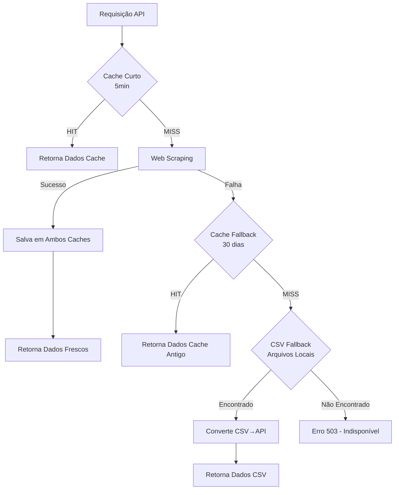

# API Flask de Web Scraping - Dados Vitivinícolas

Esta é uma API Flask que realiza web scraping do site da Embrapa para extrair dados vitivinícolas brasileiros.

## Funcionalidades

- **Autenticação HTTP Basic**: Acesso seguro aos endpoints
- **5 Endpoints de dados**: Produção, Processamento, Comercialização, Importação e Exportação
- **Filtros por ano e sub-opções**: Parâmetros opcionais para refinar consultas
- **Parsing inteligente de tabelas**: Extração estruturada de dados HTML
- **Documentação Swagger**: Interface interativa para testar a API
- **Tratamento de erros**: Logging detalhado e respostas estruturadas
- **Sistema de cache três camadas**: Cache Redis (curto/longo prazo) + fallback CSV local
- **Alta disponibilidade**: Garante resposta mesmo quando web scraping e Redis falham

## Configuração do Ambiente

### Opção 1: Docker (Recomendado)

#### Deploy Rápido com Versionamento Automático
```bash
# Deploy completo com rebuild e versionamento
python docker-deploy.py

# Deploy para produção
python docker-deploy.py --env production

# Deploy sem rebuild (usar imagem existente)
python docker-deploy.py --no-rebuild

# Deploy com logs
python docker-deploy.py --logs
```

#### Comandos Docker Manuais
```bash
# Construir imagem com versionamento
python docker-build.py

# Construir para produção
python docker-build.py --env production

# Iniciar com docker-compose
docker-compose up -d

# Ver logs
docker-compose logs -f app

# Parar containers
docker-compose down

# Rebuild completo
docker-compose down && docker-compose build --no-cache && docker-compose up -d
```

#### Verificar Versão no Docker
```bash
# Testar API e ver versão atual
curl http://localhost:5000/heartbeat

# Ver informações da imagem Docker
docker images flask-webscraping-api

# Ver labels da imagem (metadados de versão)
docker inspect flask-webscraping-api:latest
```

### Opção 2: Ambiente Local

#### 1. Criar e Ativar Ambiente Virtual

**Windows:**
```bash
# Criar ambiente virtual
python -m venv venv

# Ativar ambiente virtual
venv\Scripts\activate
```

**Linux/Mac:**
```bash
# Criar ambiente virtual
python -m venv venv

# Ativar ambiente virtual
source venv/bin/activate
```

#### 2. Instalar Dependências

```bash
pip install -r requirements.txt
```

#### 3. Executar a Aplicação

```bash
python app.py
```

A aplicação estará disponível em: `http://localhost:5000`

## 🚀 Deploy em Produção (AWS Elastic Beanstalk)

### Gerar Pacote de Deploy

Para fazer deploy no AWS Elastic Beanstalk, primeiro gere o pacote ZIP:

```bash
# Execute no diretório do projeto
python create_eb_package.py
```

**Saída esperada:**
```
📈 Incrementando versão...
✅ Nova versão: 1.1.4
📦 Criando pacote: flask-webscraping-api-v1.1.4-20250525-220000.zip
📏 Tamanho: 0.01 MB
✅ Pacote criado com sucesso!
```

### Documentação Completa de Deploy

- **📋 Guia passo a passo**: [`AWS_DEPLOY_GUIDE.md`](AWS_DEPLOY_GUIDE.md)
- **⚙️ Configurações de deploy**: [`DEPLOY_README.md`](DEPLOY_README.md)

### Deploy Rápido

1. **Gerar pacote**: `python create_eb_package.py`
2. **Acessar AWS**: [Elastic Beanstalk Console](https://console.aws.amazon.com/elasticbeanstalk/)
3. **Criar aplicação**: Python 3.11 platform
4. **Upload**: Arquivo ZIP gerado
5. **Configurar**: Variáveis de ambiente (ver DEPLOY_README.md)
6. **Testar**: `https://sua-app.elasticbeanstalk.com/heartbeat`

### Atualizações Futuras

```bash
# Gerar nova versão
python create_eb_package.py

# Deploy via console AWS
# Upload do novo arquivo ZIP gerado
```

> 💡 **Versionamento automático**: O script incrementa a versão a cada execução!

---

## Endpoints Disponíveis

### Autenticação
- **Usuário 1**: `user1` / `password1`
- **Usuário 2**: `user2` / `password2`

### Endpoints de Dados

| Endpoint | Descrição | Parâmetros Opcionais | Autenticação |
|----------|-----------|---------------------|---------------|
| `/producao` | Dados de produção | `year`, `sub_option` | ✅ Requerida |
| `/processamento` | Dados de processamento | `year`, `sub_option` | ✅ Requerida |
| `/comercializacao` | Dados de comercialização | `year`, `sub_option` | ✅ Requerida |
| `/importacao` | Dados de importação | `year`, `sub_option` | ✅ Requerida |
| `/exportacao` | Dados de exportação | `year`, `sub_option` | ✅ Requerida |

### Endpoints de Monitoramento

| Endpoint | Descrição | Autenticação |
|----------|-----------|--------------|
| `/heartbeat` | Health check da API | ❌ Não requerida |

### Documentação Swagger
Acesse: `http://localhost:5000/apidocs/`

### Collection Postman
- **Arquivo**: `postman_collection.json`
- **Guia de uso**: `POSTMAN_GUIDE.md`
- **Importar no Postman**: Import > Upload Files > Selecionar `postman_collection.json`

## Parâmetros de Filtro

### Parâmetro `year`
- **Tipo**: Integer
- **Range válido**: 1970-2024
- **Descrição**: Ano para filtrar os dados (válido para todas as APIs)
- **Exemplo**: `?year=2023`

### Parâmetro `sub_option`
- **Tipo**: String
- **Descrição**: Sub-opção específica para cada endpoint
- **Validação**: Lista fechada de valores por endpoint

#### Valores válidos por endpoint:

**`/producao`**
- `VINHO DE MESA`
- `VINHO FINO DE MESA (VINIFERA)`
- `SUCO DE UVA`
- `DERIVADOS`

**`/processamento`**
- `viniferas`
- `americanas`
- `mesa`
- `semclass`

**`/comercializacao`**
- `VINHO DE MESA`
- `ESPUMANTES`
- `UVAS FRESCAS`
- `SUCO DE UVA`

**`/importacao`**
- `vinhos`
- `espumantes`
- `frescas`
- `passas`
- `suco`

**`/exportacao`**
- `vinho`
- `uva`
- `espumantes`
- `suco`

### Validação de Parâmetros
- Parâmetros inválidos retornam erro **HTTP 400** com mensagem explicativa
- Ambos os parâmetros são **opcionais**
- Podem ser usados individualmente ou em combinação

## Exemplos de Uso

### 1. Usando curl

```bash
# Dados de produção (sem filtros)
curl -u user1:password1 "http://localhost:5000/producao"

# Dados de produção filtrados por ano
curl -u user1:password1 "http://localhost:5000/producao?year=2023"

# Dados de produção com sub-opção específica
curl -u user1:password1 "http://localhost:5000/producao?sub_option=VINHO%20DE%20MESA"

# Dados de produção com ambos os filtros
curl -u user1:password1 "http://localhost:5000/producao?year=2023&sub_option=SUCO%20DE%20UVA"

# Dados de processamento com filtros
curl -u user1:password1 "http://localhost:5000/processamento?year=2022&sub_option=viniferas"

# Dados de exportação com filtros
curl -u user1:password1 "http://localhost:5000/exportacao?year=2023&sub_option=vinho"

# Exemplo de erro - ano inválido (retorna HTTP 400)
curl -u user1:password1 "http://localhost:5000/producao?year=1969"

# Exemplo de erro - sub-opção inválida (retorna HTTP 400)
curl -u user1:password1 "http://localhost:5000/producao?sub_option=OPCAO_INEXISTENTE"

# Health check da API (sem autenticação)
curl "http://localhost:5000/heartbeat"
```

### 2. Usando Python requests

```python
import requests
from requests.auth import HTTPBasicAuth

# Configurar autenticação
auth = HTTPBasicAuth('user1', 'password1')

# Exemplo 1: Requisição básica sem filtros
response = requests.get(
    'http://localhost:5000/producao',
    auth=auth
)

if response.status_code == 200:
    data = response.json()
    print("Dados de produção:", data)
else:
    print(f"Erro: {response.status_code}")

# Exemplo 2: Requisição com filtros válidos
response = requests.get(
    'http://localhost:5000/producao',
    auth=auth,
    params={
        'year': '2023',
        'sub_option': 'VINHO DE MESA'
    }
)

if response.status_code == 200:
    data = response.json()
    print("Dados filtrados:", data)
else:
    print(f"Erro: {response.status_code}")

# Exemplo 3: Tratamento de erro de validação
response = requests.get(
    'http://localhost:5000/producao',
    auth=auth,
    params={'year': '1969'}  # Ano inválido
)

if response.status_code == 400:
    error_data = response.json()
    print(f"Erro de validação: {error_data['error']}")
elif response.status_code == 200:
    data = response.json()
    print("Dados:", data)

# Exemplo 4: Diferentes endpoints com suas sub-opções
endpoints_examples = {
    'processamento': {'year': '2023', 'sub_option': 'viniferas'},
    'comercializacao': {'year': '2022', 'sub_option': 'ESPUMANTES'},
    'importacao': {'year': '2023', 'sub_option': 'vinhos'},
    'exportacao': {'year': '2023', 'sub_option': 'uva'}
}

for endpoint, params in endpoints_examples.items():
    response = requests.get(
        f'http://localhost:5000/{endpoint}',
        auth=auth,
        params=params
    )
    
    if response.status_code == 200:
        data = response.json()
        cache_status = data.get('cached', 'unknown')
        print(f"✅ {endpoint}: Dados obtidos com sucesso (cache: {cache_status})")
    else:
        print(f"❌ {endpoint}: Erro {response.status_code}")

# Exemplo 5: Monitoramento de cache e performance
import time

def test_cache_performance():
    """Demonstra o funcionamento do cache"""
    
    # Primeira requisição (dados frescos)
    start_time = time.time()
    response1 = requests.get('http://localhost:5000/producao?year=2023', auth=auth)
    time1 = time.time() - start_time
    
    if response1.status_code == 200:
        data1 = response1.json()
        print(f"1ª requisição: {time1:.2f}s - Cache: {data1.get('cached', 'unknown')}")
    
    # Segunda requisição (cache hit)
    start_time = time.time()
    response2 = requests.get('http://localhost:5000/producao?year=2023', auth=auth)
    time2 = time.time() - start_time
    
    if response2.status_code == 200:
        data2 = response2.json()
        print(f"2ª requisição: {time2:.2f}s - Cache: {data2.get('cached', 'unknown')}")
        print(f"Melhoria de performance: {((time1 - time2) / time1 * 100):.1f}%")

# Executar teste de performance
test_cache_performance()
```

## Estrutura de Resposta

### Resposta Padrão com Cache
```json
{
  "data": {
    "header": [
      ["Coluna1", "Coluna2", "Coluna3"]
    ],
    "body": [
      {
        "item_data": ["Item Principal"],
        "sub_items": [
          ["Sub-item 1", "Valor 1"],
          ["Sub-item 2", "Valor 2"]
        ]
      }
    ],
    "footer": [
      ["Total", "Valor Total"]
    ]
  },
  "cached": false
}
```

### Indicadores de Cache
- `"cached": false` - Dados frescos obtidos via web scraping
- `"cached": "short_term"` - Dados do cache de curto prazo (5 min)
- `"cached": "fallback"` - Dados do cache de fallback (30 dias)

## Dependências Principais

- **Flask**: Framework web
- **requests**: Cliente HTTP para web scraping
- **BeautifulSoup4**: Parser HTML/XML
- **Flask-HTTPAuth**: Autenticação HTTP Basic
- **flasgger**: Documentação Swagger automática
- **Redis**: Sistema de cache em memória

## 🗄️ Sistema de Cache Três Camadas

A API implementa um **sistema de cache robusto de três camadas** que garante alta disponibilidade e performance mesmo em cenários de falha:

### Camadas do Sistema

#### 🚀 **Camada 1: Cache Curto Prazo (Redis)**
- **TTL**: 5 minutos (configurável via `SHORT_CACHE_TTL`)
- **Propósito**: Respostas rápidas para requisições frequentes
- **Comportamento**: Dados frescos para uso imediato

#### 🛡️ **Camada 2: Cache Fallback (Redis)**  
- **TTL**: 30 dias (configurável via `FALLBACK_CACHE_TTL`)
- **Propósito**: Backup quando web scraping falha
- **Comportamento**: Dados históricos para alta disponibilidade

#### 📁 **Camada 3: Fallback CSV (Arquivos Locais)**
- **TTL**: Arquivos estáticos locais  
- **Propósito**: Última linha de defesa quando Redis está indisponível
- **Comportamento**: Dados estruturados em CSV convertidos para formato API

### Fluxo de Execução



### Mapeamento Endpoint-to-CSV

O sistema mapeia automaticamente cada endpoint para arquivos CSV específicos:

```python
ENDPOINT_CSV_MAP = {
    'producao': {
        'default': 'Producao.csv',
        'sub_options': {
            'VINHO DE MESA': 'Producao.csv',
            'VINHO FINO DE MESA (VINIFERA)': 'Producao.csv',
            'SUCO DE UVA': 'Producao.csv',
            'DERIVADOS': 'Producao.csv'
        }
    },
    'processamento': {
        'default': 'ProcessaViniferas.csv',
        'sub_options': {
            'viniferas': 'ProcessaViniferas.csv',
            'americanas': 'ProcessaAmericanas.csv',
            'mesa': 'ProcessaMesa.csv',
            'semclass': 'ProcessaSemclass.csv'
        }
    },
    'comercializacao': {
        'default': 'Comercio.csv'
    },
    'importacao': {
        'default': 'ImpVinhos.csv',
        'sub_options': {
            'vinhos': 'ImpVinhos.csv',
            'espumantes': 'ImpEspumantes.csv',
            'frescas': 'ImpFrescas.csv',
            'passas': 'ImpPassas.csv',
            'suco': 'ImpSuco.csv'
        }
    },
    'exportacao': {
        'default': 'ExpVinho.csv',
        'sub_options': {
            'vinho': 'ExpVinho.csv',
            'uva': 'ExpUva.csv',
            'espumantes': 'ExpEspumantes.csv',
            'suco': 'ExpSuco.csv'
        }
    }
}
```

### Configuração CSV Fallback

#### Estrutura de Diretórios
```
data/
└── fallback/
    ├── Producao.csv
    ├── ProcessaViniferas.csv
    ├── ProcessaAmericanas.csv
    ├── ProcessaMesa.csv
    ├── ProcessaSemclass.csv
    ├── Comercio.csv
    ├── ImpVinhos.csv
    ├── ImpEspumantes.csv
    ├── ImpFrescas.csv
    ├── ImpPassas.csv
    ├── ImpSuco.csv
    ├── ExpVinho.csv
    ├── ExpUva.csv
    ├── ExpEspumantes.csv
    └── ExpSuco.csv
```

#### Configuração Avançada CSV
```bash
# Configuração CSV Fallback
CSV_FALLBACK_DIR=data/fallback    # Default: data/fallback
CSV_CACHE_ENABLED=true            # Default: true
CSV_MAX_CACHE_SIZE=50             # Default: 50 files
CSV_CACHE_TTL=1800                # Default: 1800s (30min)
```

#### Formato de Resposta CSV Fallback
```json
{
  "data": {
    "header": [["Produto", "Quantidade (L.)", "Ano"]],
    "body": [
      {"item_data": ["VINHO DE MESA", "123456789", "2023"], "sub_items": []},
      {"item_data": ["VINHO FINO", "987654321", "2023"], "sub_items": []}
    ],
    "footer": [["TOTAL GERAL", "1567890233", "2023"]]
  },
  "cached": "csv_fallback",
  "data_source": "Local CSV files (Redis unavailable)",
  "freshness": "Static data from local files",
  "endpoint": "producao",
  "status": "success"
}
```

### Estados de Cache na Resposta

A API retorna um campo `cached` que indica a fonte dos dados:

| Valor | Descrição | TTL | Performance |
|-------|-----------|-----|-------------|
| `false` | Dados frescos via web scraping | N/A | ⚡ Tempo real |
| `"short_term"` | Cache curto prazo (Redis) | 5min | ⚡ Muito rápida |
| `"fallback"` | Cache fallback (Redis) | 30d | ⚡ Rápida |
| `"csv_fallback"` | Fallback CSV (arquivos locais) | Estático | ⚡ Rápida |

### Monitoramento e Estatísticas

#### Endpoint de Estatísticas de Cache
```bash
# Via API (requer autenticação)
GET /cache-stats

# Resposta detalhada
{
  "timestamp": "2025-01-26T10:30:00.123456+00:00",
  "redis_available": true,
  "cache_layers": {
    "short_term": {
      "entries": 15,
      "ttl_seconds": 300,
      "status": "active"
    },
    "fallback": {
      "entries": 127,
      "ttl_seconds": 2592000,
      "status": "active"
    },
    "csv_fallback": {
      "status": "active",
      "cache_enabled": true,
      "entries": 12,
      "max_size": 50,
      "hit_rate_percent": 85.5,
      "cache_efficiency": "excellent"
    }
  },
  "csv_fallback_validation": {
    "overall_status": "healthy",
    "total_endpoints": 5,
    "valid_endpoints": 5,
    "existing_files": 15,
    "missing_files": 0
  },
  "overall_status": {
    "active_layers": 3,
    "total_layers": 3,
    "health": "excellent"
  }
}
```

#### Logs Avançados do Sistema
```python
# Logs com emojis para identificação visual
🎯 Cache HIT   - "Layer 1 HIT: Returning short-term cache data"
❌ Cache MISS  - "Layer 1 MISS: No short-term cache available"
🌐 Web Scraping - "Fresh data fetched and cached"
⚠️ Fallback   - "Layer 2 HIT: Using fallback cache due to scraping failure"
🗂️ CSV Fallback - "Layer 3 HIT: Returning CSV fallback data"
💥 All Failed  - "ALL LAYERS FAILED: All data sources unavailable"
```

### Casos de Uso por Cenário

#### ✅ **Cenário Normal**
1. **Requisição** → Cache curto (miss) → Web scraping → Dados frescos
2. **Requisição seguinte** → Cache curto (hit) → Resposta instantânea

#### ⚠️ **Site Embrapa Indisponível**
1. **Requisição** → Cache curto (miss) → Web scraping (falha) → Cache fallback (hit) → Dados antigos

#### 🚨 **Redis Indisponível**  
1. **Requisição** → Redis (falha) → Web scraping (falha) → CSV fallback (hit) → Dados estáticos

#### 💥 **Falha Total**
1. **Requisição** → Todas as camadas (falha) → Erro 503 com contexto detalhado

### Gerenciamento do Cache

#### Limpeza Manual (se necessário)
```bash
# Conectar ao Redis via Docker
docker exec -it fiap_5mlet_tcm1_grp5-redis-1 redis-cli

# Listar chaves de cache
KEYS short:*
KEYS fallback:*

# Limpar cache específico
DEL short:producao:*
DEL fallback:*

# Limpar todo o cache
FLUSHDB
```

#### Validação CSV Fallback
```bash
# Via Python REPL (com aplicação rodando)
from cache import CacheManager
cache_manager = CacheManager()

# Validar mapeamento de endpoints
validation = cache_manager.validate_csv_fallback()
print(validation)

# Testar endpoint específico
csv_data = cache_manager.get_csv_fallback('producao', {'sub_option': 'VINHO DE MESA'})
print(csv_data)
```

#### Configuração de TTL Personalizada
```bash
# Cache mais agressivo (1 minuto)
SHORT_CACHE_TTL=60

# Cache de fallback mais longo (7 dias)
FALLBACK_CACHE_TTL=604800

# Cache CSV com TTL menor (10 minutos)
CSV_CACHE_TTL=600
```

### Vantagens do Sistema Três Camadas

#### 🚀 **Performance**
- **Respostas sub-segundo**: Cache curto para dados recentes
- **Redução de latência**: Evita web scraping desnecessário  
- **Otimização de recursos**: Menor uso de CPU e rede

#### 🛡️ **Alta Disponibilidade**
- **Tolerância a falhas múltiplas**: 3 camadas independentes
- **Zero downtime**: Sempre há uma fonte de dados disponível
- **Graceful degradation**: Degrada graciosamente mantendo funcionalidade

#### 📊 **Observabilidade**
- **Logs detalhados**: Registra toda a cadeia de fallback
- **Métricas em tempo real**: Performance por camada
- **Health checks**: Status completo do sistema de cache

#### 💾 **Flexibilidade**
- **Configuração por ambiente**: TTLs ajustáveis por cenário
- **Dados históricos**: Cache fallback mantém dados por semanas
- **Dados locais**: CSV garante funcionamento offline

### Detalhes de Implementação Técnica

#### Arquitetura do Módulo Cache
```
cache/
├── __init__.py          # Exposição das classes principais
├── cache_manager.py     # Gerenciador principal (3 camadas)
├── redis_client.py      # Cliente Redis com singleton
└── csv_fallback.py      # Gerenciador CSV fallback
```

#### Classe CacheManager (Atualizada)
```python
# Métodos de cache Redis
get_short_cache(endpoint, params)        # Camada 1: Cache 5min
set_short_cache(endpoint, data, params)  # Armazena cache 5min
get_fallback_cache(endpoint, params)     # Camada 2: Cache 30d  
set_fallback_cache(endpoint, data, params) # Armazena cache 30d

# Métodos de CSV fallback
get_csv_fallback(endpoint, params)       # Camada 3: CSV local
validate_csv_fallback()                  # Valida arquivos CSV
get_csv_fallback_stats()                 # Estatísticas CSV

# Utilitários
clear_cache(endpoint, cache_type)        # Limpa cache específico
get_cache_stats()                        # Estatísticas completas (3 camadas)
```

#### Integração com Endpoints (Atualizada)
```python
def get_content_with_cache(endpoint_name, url, cache_manager, logger, params=None):
    # Camada 1: Cache curto prazo (5min)
    cached_response = cache_manager.get_short_cache(endpoint_name, params)
    if cached_response:
        logger.info(f"✅ Layer 1 HIT: short-term cache for {endpoint_name}")
        return cached_response['data'], cached_response['cached']
    
    # Camada 2: Web scraping + armazenamento
    try:
        response = requests.get(url, timeout=30)
        parsed_data = parse_html_content(response.text, logger)
        
        # Armazena em ambos os caches Redis
        cache_manager.set_short_cache(endpoint_name, parsed_data, params)
        cache_manager.set_fallback_cache(endpoint_name, parsed_data, params)
        
        logger.info(f"✅ Fresh data fetched and cached for {endpoint_name}")
        return parsed_data, False
        
    except requests.RequestException as e:
        logger.error(f"❌ Web scraping failed for {endpoint_name}: {e}")
        
        # Camada 2: Cache fallback Redis (30d)
        cached_response = cache_manager.get_fallback_cache(endpoint_name, params)
        if cached_response:
            logger.warning(f"⚠️ Layer 2 HIT: fallback cache for {endpoint_name}")
            return cached_response['data'], cached_response['cached']
        
        # Camada 3: CSV fallback (arquivos locais)
        logger.info(f"🗂️ Attempting CSV fallback for {endpoint_name}")
        csv_response = cache_manager.get_csv_fallback(endpoint_name, params)
        if csv_response:
            logger.warning(f"✅ Layer 3 HIT: CSV fallback for {endpoint_name}")
            return csv_response, csv_response['cached']
        
        # Todas as camadas falharam
        logger.critical(f"💥 ALL LAYERS FAILED for {endpoint_name}")
        return None, False
```

#### Variáveis de Ambiente Completas
```bash
# Configuração Redis
REDIS_HOST=localhost              # Default: localhost
REDIS_PORT=6379                  # Default: 6379
REDIS_DB=0                       # Default: 0
REDIS_PASSWORD=                  # Default: None

# Configuração Cache TTL
SHORT_CACHE_TTL=300              # Default: 300 (5 min)
FALLBACK_CACHE_TTL=2592000        # Default: 2592000 (30 dias)

# Configuração CSV Fallback
CSV_FALLBACK_DIR=data/fallback    # Default: data/fallback
CSV_CACHE_ENABLED=true            # Default: true
CSV_MAX_CACHE_SIZE=50             # Default: 50
CSV_CACHE_TTL=1800                # Default: 1800 (30 min)

# Configuração Aplicação
LOG_LEVEL=INFO                    # Default: INFO
```

## Versionamento Automático

A aplicação possui um **sistema de versionamento simples** baseado em arquivo que incrementa a versão automaticamente a cada alteração.

### Como Funciona
- **Arquivo de versão**: `version.txt` contém a versão atual (formato: MAJOR.MINOR.PATCH)
- **Incremento automático**: A versão é incrementada automaticamente nos builds
- **Tipos de incremento**: major (X.0.0), minor (X.Y.0), patch (X.Y.Z) - padrão
- **Integração Docker**: Funciona tanto em ambiente local quanto em containers
- **Fallback robusto**: Sistema funciona independente de Git ou outras dependências

### Scripts de Build e Deploy

#### Build Local
```bash
# Build local com incremento patch (padrão)
python build.py --type local

# Build com incremento minor (nova funcionalidade)
python build.py --type local --increment minor

# Build com incremento major (breaking changes)
python build.py --type local --increment major

# Build sem executar testes
python build.py --type local --no-tests
```

#### Build Docker
```bash
# Build Docker com incremento de versão automático
python build.py --type docker

# Build para ambiente de produção
python build.py --type docker --env production --increment minor

# Build para desenvolvimento
python build.py --type docker --env development
```

#### Deploy Completo (Recomendado)
```bash
# Deploy completo: build + deploy + teste
python build.py --type deploy

# Deploy para produção com incremento minor
python build.py --type deploy --env production --increment minor

# Deploy para desenvolvimento
python build.py --type deploy --env development
```

### Gerenciar Versão Manualmente

#### Visualizar Versão
```bash
# Ver versão atual com detalhes
python simple_version.py --show

# Ver apenas o número da versão
cat version.txt

# Ver versão via API
curl http://localhost:5000/heartbeat
```

#### Incrementar Versão
```bash
# Incremento patch: 1.1.0 -> 1.1.1 (correções)
python simple_version.py --increment patch

# Incremento minor: 1.1.0 -> 1.2.0 (novas funcionalidades)
python simple_version.py --increment minor

# Incremento major: 1.1.0 -> 2.0.0 (breaking changes)
python simple_version.py --increment major
```

#### Definir Versão Específica
```bash
# Definir versão específica
python simple_version.py --set 2.0.0

# Resetar para versão inicial
python simple_version.py --set 1.0.0
```

### Verificar Versão em Diferentes Ambientes

#### Local
```bash
# Via script Python
python simple_version.py --show

# Via arquivo
type version.txt  # Windows
cat version.txt   # Linux/Mac
```

#### Docker
```bash
# Via API (container rodando)
curl http://localhost:5000/heartbeat

# Via logs do container
docker-compose logs app | grep -i version

# Via labels da imagem
docker inspect flask-webscraping-api:latest
```

#### API Response
```json
{
  "version": "1.1.0",
  "version_info": {
    "version": "1.1.0",
    "build_date": "2025-01-26T10:30:00.123456",
    "environment": "production",
    "source": "docker"
  }
}
```

### Arquivos do Sistema de Versionamento
- **`version.txt`**: Arquivo principal com a versão atual (ex: 1.1.0)
- **`simple_version.py`**: Script para gerenciar versões manualmente
- **`build.py`**: Script unificado de build que incrementa automaticamente
- **`app.py`**: Aplicação Flask que lê e exibe a versão

### Fluxo de Trabalho Recomendado
1. **Desenvolvimento**: Use `python build.py --type local` para builds locais
2. **Teste**: Use `python build.py --type deploy` para testar em Docker
3. **Produção**: Use `python build.py --type deploy --env production --increment minor`
4. **Hotfix**: Use `python build.py --type deploy --increment patch`

### Vantagens do Sistema Simples
- ✅ **Simplicidade**: Apenas um arquivo `version.txt`
- ✅ **Independência**: Não depende de Git ou ferramentas externas
- ✅ **Automação**: Incremento automático nos builds
- ✅ **Flexibilidade**: Controle manual quando necessário
- ✅ **Integração**: Funciona em local e Docker
- ✅ **Visibilidade**: Versão visível na API e logs

## Desenvolvimento

### Desativar Ambiente Virtual
```bash
deactivate
```

### Atualizar Dependências
```bash
pip freeze > requirements.txt
```

## Logs e Debugging

A aplicação roda em modo debug por padrão. Os logs incluem:
- Erros de requisição HTTP
- Problemas de parsing de tabelas
- Informações sobre tabelas não encontradas

## Testes

### Executar Todos os Testes
```bash
python run_all_tests.py
```

### Testes Individuais
```bash
# Teste de heartbeat e endpoints básicos
python test_heartbeat.py

# Teste de validação de parâmetros
python test_validation.py

# Teste básico da API
python test_api.py

# Teste detalhado da API
python detailed_test.py
```

### Tipos de Teste Disponíveis
- **Heartbeat**: Verifica se a API está funcionando
- **Validação**: Testa as validações de parâmetros `year` e `sub_option`
- **Básico**: Testa todos os endpoints principais
- **Detalhado**: Análise aprofundada da estrutura de resposta

## Notas Importantes

- A aplicação faz scraping do site oficial da Embrapa
- Respeite os termos de uso do site fonte
- A estrutura das tabelas pode variar dependendo dos dados disponíveis
- Alguns endpoints podem não ter dados para determinados anos ou sub-opções
- **Validação rigorosa**: Parâmetros inválidos retornam erro HTTP 400
- **Cache inteligente**: Dados são armazenados em cache para melhor performance 